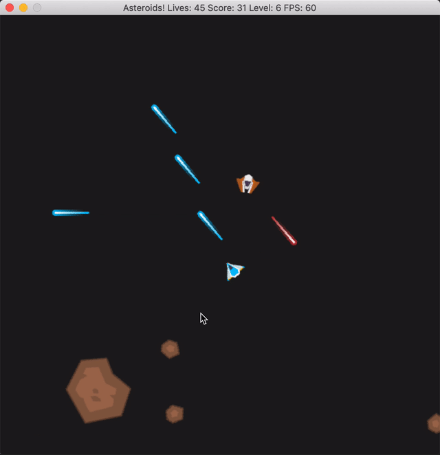

# ASTEROIDS!

An SDL game based on the classic Asteroids arcade game. Defeat enemy spaceships
and blast away dangerous asteroids. 

* Press <kbd>SPACE</kbd> to fire lasers.
* Press <kbd>↑</kbd> to accelerate.
* Press <kbd>←</kbd> to turn left.
* Press <kbd>→</kbd> to turn right.

Completed as part of Udacity's C++ Nanodegree Program.

Credit [Kenney](https://kenney.nl) for game artwork.

## Dependencies for Running Locally
* cmake >= 3.7
  * All OSes: [click here for installation instructions](https://cmake.org/install/)
* make >= 4.1 (Linux, Mac), 3.81 (Windows)
  * Linux: make is installed by default on most Linux distros
  * Mac: [install Xcode command line tools to get make](https://developer.apple.com/xcode/features/)
  * Windows: [Click here for installation instructions](http://gnuwin32.sourceforge.net/packages/make.htm)
* SDL2 >= 2.0
  * All installation instructions can be found [here](https://wiki.libsdl.org/Installation)
  * Note that for Linux, an `apt` or `apt-get` installation is preferred to building from source.
* SDL2_image >= 2.0
  * All installation instructions can be found [here](https://www.libsdl.org/projects/SDL_image/)
  * For Linux, install via `sudo apt-get install libsdl2-image-dev`.
* gcc/g++ >= 5.4
  * Linux: gcc / g++ is installed by default on most Linux distros
  * Mac: same deal as make - [install Xcode command line tools](https://developer.apple.com/xcode/features/)
  * Windows: recommend using [MinGW](http://www.mingw.org/)

## Basic Build Instructions

1. Clone this repo.
2. Make a build directory in the top level directory: `mkdir build && cd build`
3. Compile: `cmake .. && make`
4. Run it: `./Asteroids`.

## File and Class Structure
* `main.cpp`
  * Starts the game loop.
* `game.cpp/h`
  * Definition of the `Game` class that updates the game state.
* `renderer.cpp/h`
  * Definition of the `Renderer` class that renders game objects to the screen.
* `controller.cpp/h`
  * Definition of the `Controller` class that handles keyboard inputs.
* `game_object.cpp/h`
  * Definition of the `GameObject` base class that encapsulates data for objects
  that interact with the game loop and are rendered to the screen.
* `asteroids.cpp/h`
  * Definition of the `Asteroid` class derived from `GameObject` that defines the 
  behavior of asteroids. 
* `ship.cpp/h`
  * Definition of the `Ship` class derived from `GameObject` that defines the
  behavior of spaceships.
* `spacecraft.cpp/h`
  * Definition of the `Spacecraft` class derived from `Ship` that defines the
  behavior of the player spaceship.
* `enemy.cpp/h`
  * Definition of the `Enemy` class derived from `Ship` that defines the
  behavior of the enemy spaceships.
* `laser.cpp/h`
  * Definition of the `Laser` class derived from `GameObject` that defines the
  behavior of the lasers that are fired from spaceships.
* `collision_detection.cpp/h`
  * Helper functions for detecting collisions between game objects.
* `asteroid_constants.h`
  * Defines constants used throughout the program.

## Capstone Project Rubric

